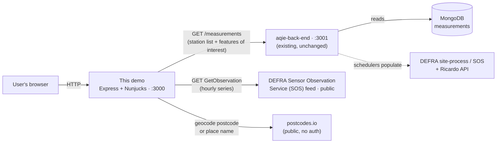

# aqie-demo-data-visualisations

`Node.js` prototype template, using the [GOV.UK Prototype Kit](https://github.com/alphagov/govuk-prototype-kit) and
the [GOV.UK Frontend](https://github.com/alphagov/govuk-frontend).

> Basically the `GOV.UK Prototype Kit` and `GOV.UK Frontend` wrapped up and provided on the Core Delivery Platform

---

## Contents

- [About this prototype](#about-this-prototype)
  - [Architecture & data flow](#architecture--data-flow)
  - [Data sources](#data-sources)
  - [Search](#search)
  - [Cron jobs / scheduled tasks](#cron-jobs--scheduled-tasks)
  - [Dependencies](#dependencies)
  - [What changes are needed to `aqie-back-end`?](#what-changes-are-needed-to-aqie-back-end)
  - [Key design & implementation choices](#key-design--implementation-choices)
  - [Pollutants, timeframes and data shapes](#pollutants-timeframes-and-data-shapes)
  - [Known limitations (this is a prototype, not production)](#known-limitations-this-is-a-prototype-not-production)
  - [Feasibility assessment](#feasibility-assessment)
  - [Running this prototype locally](#running-this-prototype-locally)
- [Requirements](#requirements)
  - [Node.js](#nodejs)
- [GOV.UK Prototype Kit and GOV.UK Frontend](#govuk-prototype-kit-and-govuk-frontend)
- [Using the refreshed GOV.UK brand](#using-the-refreshed-govuk-brand)
- [Setting a password](#setting-a-password)
- [Setting multiple passwords](#setting-multiple-passwords)
- [Removing the need for a password](#removing-the-need-for-a-password)
- [Npm scripts](#npm-scripts)
- [Updating dependencies](#updating-dependencies)
- [Environment Variables and Secrets](#environment-variables-and-secrets)
  - [Local development](#local-development)
  - [Environment Variables on CDP](#environment-variables-on-cdp)
  - [Environment Variables in the GOV.UK Prototype Kit](#environment-variables-in-the-govuk-prototype-kit)
  - [Secrets](#secrets)
- [Creating a secret](#creating-a-secret)
- [Docker](#docker)
  - [Development image](#development-image)
  - [Production image](#production-image)
  - [Debug docker](#debug-docker)
- [Licence](#licence)
  - [About the licence](#about-the-licence)

---

# About this prototype

This repo is a **non-production spike** exploring interactive hourly air-quality graphs for each
monitoring site, for the DEFRA "Get air pollution data" service. It lets a user find a monitoring
station (by town, postcode or station name), see a **pollutant summary table** (24-hour average, data
capture %, hourly exceedances) and **interactive hourly charts** (small multiples or a combined
overlay) across several timeframes.

It was built against two acceptance criteria:

1. A prototype (non-production) graph using **live** monitoring-site data, meeting **government
   accessibility standards**.
2. An **assessment of the feasibility and effort** of delivering hourly site graphs into the Get Data
   service — see [Feasibility assessment](#feasibility-assessment).

> [!IMPORTANT]
> Everything in this spike is **self-contained in this repo** — it makes **no changes to
> `aqie-back-end`**. The proper production home for some of this logic is the back-end; that is
> documented in [docs/productionisation-notes.md](docs/productionisation-notes.md), together with a migration
> checklist and the verified feed facts.

## Architecture & data flow

All external calls are made **server-side** (Express), so there is no browser cross-origin resource
sharing (CORS) and no API keys in
the client. The summary table and data tables are **rendered on the server** (they work with
JavaScript disabled); the D3 charts are layered on top as progressive enhancement, hydrated from a
JSON block embedded in the page.



## Data sources

| Source                                            | Provides                                                                                                 | Auth          | Called by                                                      | Notes                                                                                                                                                        |
| ------------------------------------------------- | -------------------------------------------------------------------------------------------------------- | ------------- | -------------------------------------------------------------- | ------------------------------------------------------------------------------------------------------------------------------------------------------------ |
| **`aqie-back-end` `GET /measurements`** (`:3001`) | Station list (name, `localSiteID`, coordinates) and, per pollutant, the **feature-of-interest (FOI)** id | None (local)  | Demo server ([app/lib/aqie-api.js](app/lib/aqie-api.js))       | Read-only; the back-end is **not modified**. Data is populated by the back-end's own cron jobs.                                                              |
| **DEFRA SOS `GetObservation`** feed               | The **full hourly time series** per pollutant (Sensor Web Enablement (SWE) encoded XML)                  | None (public) | Demo server ([app/lib/sos-history.js](app/lib/sos-history.js)) | The demo fetches and decodes this **directly**. This is the data the back-end currently fetches then discards (`/measurements` keeps only the latest value). |
| **postcodes.io**                                  | Latitude/longitude for a postcode or outcode (`/postcodes`, `/outcodes`) and for a town or place name (`/places`, OS Open Names) | None (public) | Demo server ([app/lib/search.js](app/lib/search.js))           | Nearest 5 stations ranked by haversine distance. See [Search](#search) for the resolution order.                                                             |

> [!NOTE]
> **Why the SOS feed directly?** No existing back-end endpoint returns the hourly series —
> `/measurements` truncates it to the latest value (`swe:values.split(',').pop()`) and `/aurnData`
> (PR #157) returns a single Daily Air Quality Index (DAQI) value per station, which cannot drive a
> per-pollutant hourly graph.
> The public SOS feed needs **no credentials**, so the demo can stay self-contained. See
> [docs/productionisation-notes.md](docs/productionisation-notes.md).

## Search

A user can search by **town or place name**, **postcode or outcode**, or **monitoring station name**.
[app/lib/search.js](app/lib/search.js) resolves a query in this order, stopping at the first hit:

| # | Query looks like            | Lookup                                  | Result                                          |
| - | --------------------------- | --------------------------------------- | ----------------------------------------------- |
| 1 | Postcode or outcode         | postcodes.io `/postcodes` or `/outcodes` | 5 nearest stations, with distance in km          |
| 2 | Part of a station name      | Local substring match on `/measurements` | Up to 10 matching stations, no distance shown    |
| 3 | Anything else (town, place) | postcodes.io `/places` (OS Open Names)   | 5 nearest stations, with distance in km          |
| 4 | No match                    | —                                        | Empty results, with a prompt to try another term |

Station names are matched **before** the place lookup on purpose: "Manchester" and "Marylebone Road"
both exist in OS Open Names, so geocoding first would hide the station the user most likely meant.

Distances are great-circle (haversine) from the geocoded point to each station's coordinates, which
`/measurements` stores as `[latitude, longitude]`.

## Cron jobs / scheduled tasks

- **This demo has _no_ cron jobs and no database.** It fetches live data on every request.
- The data it reads from **`aqie-back-end`** _is_ populated by that service's schedulers (which write
  to the back-end's MongoDB). Relevant ones: pollutant measurements (hourly), monitoring-station cache
  (every 6h), AURN (Automatic Urban and Rural Network) / DAQI (every 30 min), forecasts. On a **cold
  back-end start** these run a ~90-second
  populate before the API binds, and `/measurements` is empty until the first pollutants run completes.
- **Productionisation:** if the hourly series moves to the back-end (recommended), consider a scheduler
  and/or a cache there rather than fetching SOS live per request — see
  [docs/productionisation-notes.md](docs/productionisation-notes.md).

## Dependencies

Runtime (see [package.json](package.json)):

- **`govuk-prototype-kit` 13.18.0** + **`govuk-frontend` 5.11.1** — Express/Nunjucks server and GDS components.
- **`d3` 7.9.0** — Scalable Vector Graphics (SVG) charts. Prototype Kit 13 does not bundle `application.js`, so D3 is **vendored**
  at [app/assets/javascripts/vendor/d3.min.js](app/assets/javascripts/vendor/d3.min.js) and loaded via a
  `<script>` tag on the station page only.
- **`fast-xml-parser`** — decodes the SOS XML response.
- **Node.js ≥ 22** — uses the global `fetch`, `AbortController` and `Intl` timezone formatting; no polyfills.

There is **no database, message queue, or build step** in this repo.

## What changes are needed to `aqie-back-end`?

**For this demo: none.** It relies only on the existing, unchanged `GET /measurements` endpoint.

**For production**, the hourly-series fetch + SWE decode in [app/lib/sos-history.js](app/lib/sos-history.js)
should move into `aqie-back-end` as a new **`GET /measurements/history`** endpoint (it was built and
verified there during the spike, then reverted to keep this repo self-contained). The demo's
`getHistory()` would then become a single call to that endpoint. The rationale, the exact endpoint
contract, verified SOS feed facts, and a step-by-step migration checklist are in
[docs/productionisation-notes.md](docs/productionisation-notes.md).

## Key design & implementation choices

| Choice                                                               | Why                                                                                                                       |
| -------------------------------------------------------------------- | ------------------------------------------------------------------------------------------------------------------------- |
| **Self-contained demo, no back-end change**                          | Fastest path to a testable spike; the correct home is documented for later                                                |
| **Hourly series from the public SOS feed**                           | No credentials; reflects the true marginal effort to build the feature                                                    |
| **Stations sourced from `/measurements`, not `/monitoringStations`** | The two collections share **no ids** (`MY1` vs `UKA00315`); only `/measurements` carries the FOIs the series lookup needs |
| **Canonical pollutant aliasing** (`GE10`→PM10, `GR25`→PM2.5)         | The back-end stores raw parameter ids; the UI needs canonical pollutants                                                  |
| **D3 v7 (SVG) charts**                                               | Accessibility (focusable, labelable) and MIT licence vs canvas/commercial libs                                            |
| **Combined default + small multiples variant**                       | Combined is compact for spotting episodes at a glance; small multiples avoid conflating pollutants with different scales  |
| **Server-side rendering + progressive enhancement**                  | Core info (tables) works with no JavaScript; charts enhance on top                                                        |
| **Explicit legal limits (NO₂ 200, SO₂ 350 µg/m³ only)**              | "Hourly exceedances" only applies where an hourly legal limit exists; DAQI bands are a health index, not a legal limit    |
| **Non-colour-only encoding** (colour + line style + legend)          | Web Content Accessibility Guidelines (WCAG) — do not rely on colour alone                                                 |
| **Query-param-driven variants** (`?period=`, `?layout=`)             | Every variant is a shareable, bookmarkable link — useful for user research                                               |

## Pollutants, timeframes and data shapes

**Pollutant codes.** The back-end stores measurements keyed by the **raw** DEFRA `parameter_id`, which
includes several variants per pollutant. [app/data/pollutants.js](app/data/pollutants.js) canonicalises
them before display:

| Raw codes              | Canonical | Displayed as     |
| ---------------------- | --------- | ---------------- |
| `PM25`, `GR25`         | `PM25`    | PM2.5            |
| `PM10`, `GE10`, `GR10` | `PM10`    | PM10             |
| `NO2`                  | `NO2`     | Nitrogen dioxide |
| `O3`                   | `O3`      | Ozone            |
| `SO2`                  | `SO2`     | Sulphur dioxide  |

Other upstream codes (`NO`, `NOXasNO2`, `AP25`/`AT25`, `AP10`/`AT10`) are not DAQI pollutants and are
ignored. Pollutants whose `featureOfInterest` is the sentinel `missingFOI` (or empty) are skipped —
no series can be fetched for them.

**Timeframes.** `?period=` maps to a request window and a resolution:

| `period` | Window     | Resolution                          |
| -------- | ---------- | ----------------------------------- |
| `24h`    | now − 24h  | hourly                              |
| `7d`     | now − 7d   | hourly                              |
| `month`  | now − 1 mo | daily mean (Europe/London calendar) |
| `year`   | now − 1 yr | daily mean (Europe/London calendar) |

Hourly over a year is ~8,760 points per pollutant, so long ranges are aggregated to daily means; the
trade-off is that intra-day peaks are hidden at those ranges.

**Back-end response shapes** (both read-only, unchanged):

```
GET /measurements       → { measurements: [ { name, localSiteID, location, updated,
                            pollutants: { <CODE>: { featureOfInterest, time: { date }, value, exception } } } ] }
GET /monitoringStations → { stations: [ { name, area, localAuthority, localSiteID, areaType,
                            location: { coordinates: [lat, lng] }, pollutants: [] } ] }
```

`location.coordinates` is **`[latitude, longitude]`** (latitude first — not GeoJSON order). Distances
are great-circle (haversine) from the geocoded search point.

**Internal history shape** returned by `getHistory()` — deliberately identical to the proposed
back-end endpoint, so productionising is a drop-in swap:

```
{ siteId, period, resolution: 'hourly' | 'daily', pollutants: { <CODE>: [ { time, value } ] } }
```

Values of `-9999`, `-99`, `NaN` and negatives are treated as missing and dropped, which is what the
data-capture percentage measures.

## Known limitations (this is a prototype, not production)

- **No caching or retry** — the SOS feed is hit live on each request and can be slow or return `504`s;
  a failed pollutant degrades to an empty series rather than failing the page.
- **Long timeframes are heavy** — the no-JavaScript data tables for the year view render ~365 rows × 5
  pollutants.
- **Combined chart uses a shared y-axis**, so low-value pollutants (e.g. SO₂) appear flat next to O₃.
- **Search results are not distance-capped** — a town far from any monitor still returns its 5
  nearest stations, which may be tens of kilometres away.
- **Ambiguous place names take the first match** (`/places` is queried with `limit=1`), so there is no
  disambiguation step for, say, the several Newports.
- **Service-navigation tabs** from the mockups are omitted to avoid dead links.
- Deferred production concerns (caching, rate-limiting, downsampling, stored history, auth/proxy) are
  listed in [docs/productionisation-notes.md](docs/productionisation-notes.md).

## Feasibility assessment

The second acceptance criterion. Short answer: **feasible, with low–moderate back-end effort.**

- **Back-end (low–moderate).** No new data source and no credentials are needed — the public SOS
  `GetObservation` feed already returns the full hourly series and the back-end already fetches it for
  `/measurements`, then discards all but the latest value. The change is: decode the whole
  `swe:values` block instead of the last token, build the temporal range from a requested period,
  aggregate/downsample long ranges, and add tests. Endpoint contract and file layout are in
  [docs/productionisation-notes.md](docs/productionisation-notes.md).
- **Front end (moderate).** Location search, D3 charts, accessible equivalents and the layout variants
  were the bulk of the work in this spike; it was all achievable within the Prototype Kit and reached
  **0 axe-core WCAG 2.2 A/AA violations** across all pages, verified with keyboard-only navigation,
  contrast checks and JavaScript disabled.
- **Main risks.** SOS origin reliability (`504`s observed during the spike), performance of very long
  ranges, and timezone handling at aggregation boundaries.
- **Productionisation adds** caching, rate-limiting/retry, downsampling and possibly stored history —
  the operational work, rather than the feature itself, is where the remaining effort sits.

## Running this prototype locally

1. Start `aqie-back-end` on `:3001` (it provides `/measurements`), following that repo's own README.
   It is the **standard, unmodified** service — no local changes to it are needed. Allow ~90 seconds
   for its startup populate before the API binds, then confirm with
   `curl http://localhost:3001/measurements`.
2. In this repo: `npm install`, then `npm run dev` and open `http://localhost:3000`.
3. Configuration: [.env](.env) sets `AQIE_BACKEND_URL=http://localhost:3001` (defaults to that if unset).
   `SOS_URL` can override the SOS feed base if needed.

---

## Requirements

### Node.js

Install [Node.js](http://nodejs.org/) `>= v22` and [npm](https://nodejs.org/) `>= v11`. You will find it easier to use
the Node Version Manager [nvm](https://github.com/creationix/nvm)

To use the correct version of Node.js for this application, via nvm:

```bash
cd aqie-demo-data-visualisations
nvm use
```

## GOV.UK Prototype Kit and GOV.UK Frontend

The [GOV.UK Prototype Kit](https://github.com/alphagov/govuk-prototype-kit) is a tool for building interactive
prototypes that look like pages on GOV.UK, it provides components and styles from the
[GOV.UK Frontend](https://github.com/alphagov/govuk-frontend). Both are provided by the
[Government Digital Service (GDS)](https://www.gov.uk/government/organisations/government-digital-service), this
template provides both tools in a wrapper that runs on the Core Delivery Platform at Defra.

> [!NOTE]
> The `GOV.UK Prototype Kit` is built with [express.js](https://expressjs.com/). The `Node.js`
> applications [cdp-node-frontend-template](https://github.com/DEFRA/cdp-node-frontend-template)
> and [cdp-node-backend-template](https://github.com/DEFRA/cdp-node-backend-template) at Defra are built with
> [Hapi.js](https://hapi.dev/)

- For information on the `GOV.UK Prototype Kit` see https://prototype-kit.service.gov.uk/docs/
- For tutorials on how to use the `GOV.UK Prototype Kit`
  see https://prototype-kit.service.gov.uk/docs/tutorials-and-guides
- For help with the underlying `GOV.UK Frontend` see:
  - https://design-system.service.gov.uk/
  - https://github.com/alphagov/govuk-frontend

> [!WARNING]
> The `aqie-demo-data-visualisations` is not a production ready application, it is a tool for prototyping. It is not
> designed to be used in production or to be resilient, secure or performant, nor should it be. It is designed to be
> used for prototyping ideas and testing them with users. It's a great tool for prototyping GOV web applications.

## Using the refreshed GOV.UK brand

The refreshed GOV.UK brand is available and turned on by default in the `aqie-demo-data-visualisations`. To turn it
off simply go to [app/config.json](./app/config.json) and set the `"rebrand"` property to `false`. This will turn off
the refreshed brand and use the legacy brand instead.

```json
{
  "plugins": {
    "govuk-frontend": {
      "rebrand": true
    }
  }
}
```

## Setting a password

> [!CAUTION]
> Do not commit the `.env` file to GitHub, it is in the `.gitignore` file by default. Sensitive information such as a
> password can be provided to a prototype via the Secrets page of your prototype in the CDP Portal Frontend

Basic authentication is on by default in CDP environments for prototypes. This means you will need to set a password
for your prototype. You can do this via your prototypes secrets tab in the Portal Frontend. For information on how to do
this, follow these steps:

1. Read the **Setting a password** section on https://prototype-kit.service.gov.uk/docs/publishing
1. Go to the CDP Portal Frontend
1. Log in
1. Navigate to your prototype on the services list page
1. Navigate to your prototypes `Secrets` tab
1. Add a secret with a name `PASSWORD` and a `value` of your choosing
1. Re-deploy your prototype for the new secrets to be made available to it

## Setting multiple passwords

The `GOV.UK Prototype Kit` has the ability to set up multiple passwords via secrets. For more information on how to do
this read the **If you want to create additional passwords** section on
https://prototype-kit.service.gov.uk/docs/publishing. To add a secret to an environment your prototype is running in
see [Creating a secret](#creating-a-secret)

## Removing the need for a password

By default, the `GOV.UK Prototype Kit` requires a password has been set on your prototype when it has been deployed to
an environment. If you would like to turn off this requirement you can do so by setting the following environment
variable:

```dotenv
ENV USE_AUTH=false
```

This can be set in `cdp-app-config` for instructions on how to do so
read [Environment Variables on CDP](#environment-variables-on-cdp).

## Npm scripts

All available Npm scripts can be seen in [package.json](./package.json)
To view them in your command line run:

```bash
npm run
```

## Updating dependencies

To update dependencies use [npm-check-updates](https://github.com/raineorshine/npm-check-updates):

> The following script is a good start. Check out all the options on
> the [npm-check-updates](https://github.com/raineorshine/npm-check-updates)

```bash
ncu --interactive --format group
```

## Environment Variables and Secrets

Environment variables and Secrets are used to configure your prototype. Where you set them can be seen in the table
below.

| Type                                                      | Environment | Where to set them                                   |
| --------------------------------------------------------- | ----------- | --------------------------------------------------- |
| Sensitive secrets and Non-sensitive environment variables | local       | `.env` file                                         |
| Sensitive secrets                                         | CDP         | CDP Portal Frontend services secrets page           |
| Non-sensitive environment variables                       | CDP         | CDP App Config repository by raising a pull request |

### Local development

> [!CAUTION]
> Do not store passwords in GitHub. Sensitive information such as a password can be provided to a prototype via the
> secrets page in the CDP Portal Frontend. The `.env` file is for local development only.

To set environment variables and secrets locally copy the [.env.template](./.env.template) file to `.env` and add any
environment variables or secrets your local environment needs.

### Environment Variables on CDP

When your prototype is running on a CDP environment, E.g. `dev` or `ext-test`. You can set environment variables via a
GitHub pull request.

To add environment variables read - https://github.com/DEFRA/cdp-documentation/blob/main/how-to/config.md. This will
guide you to add non-sensitive environment variables to the https://github.com/DEFRA/cdp-app-config repository via a
pull request.

### Environment Variables in the GOV.UK Prototype Kit

The following environment variables are available in the `GOV.UK Prototype Kit`. For more information see
their https://prototype-kit.service.gov.uk/docs/ or https://github.com/alphagov/govuk-prototype-kit.

| Name            | Value    | Description                                              |
| --------------- | -------- | -------------------------------------------------------- |
| `PASSWORD`      | `string` | Password for basic authentication                        |
| `PASSWORD_KEYS` | `string` | Comma-separated list of keys for password authentication |

### Secrets

To add sensitive environment variables know as secrets to your prototype. Add them via your prototypes secrets page on
the CDP Portal.

## Creating a secret

1. Go to the CDP Portal Frontend
1. Log in
1. Navigate to your prototype on the services list page
1. Navigate to your prototypes `Secrets` tab
1. Add a secret on your chosen environment with a `name` and `value` of your choosing
1. Re-deploy your prototype for the new secrets to be made available to it

## Docker

For the most part you will not need to be concerned with `docker` when running this prototype. Everything is set up and
your `docker` will automatically be built, published and pushed when you deploy a new version of your prototype via the
UI in the CDP Portal.

### Development image

Build:

```bash
docker build --target development --no-cache --tag aqie-demo-data-visualisations:development .
```

Run:

```bash
docker run -e PORT=3000 -p 3000:3000 aqie-demo-data-visualisations:development
```

### Production image

Build:

```bash
docker build --no-cache --tag aqie-demo-data-visualisations .
```

Run:

> Update the password field to your password

```bash
docker run -e PASSWORD=beepBoopBeep -e PORT=3000 -p 3000:3000 aqie-demo-data-visualisations
```

### Debug docker

To debug issues in docker and to have a look at the built docker container in the same way as when it runs on CDP. You
can run an interactive shell:

Build:

```bash
docker build --no-cache --tag aqie-demo-data-visualisations .
```

Run:

```bash
docker run -it --entrypoint /bin/ash aqie-demo-data-visualisations
```

## Licence

THIS INFORMATION IS LICENSED UNDER THE CONDITIONS OF THE OPEN GOVERNMENT LICENCE found at:

<http://www.nationalarchives.gov.uk/doc/open-government-licence/version/3>

The following attribution statement MUST be cited in your products and applications when using this information.

> Contains public sector information licensed under the Open Government license v3

### About the licence

The Open Government Licence (OGL) was developed by the Controller of Her Majesty's Stationery Office (HMSO) to enable
information providers in the public sector to license the use and re-use of their information under a common open
licence.

It is designed to encourage use and re-use of information freely and flexibly, with only a few conditions.
