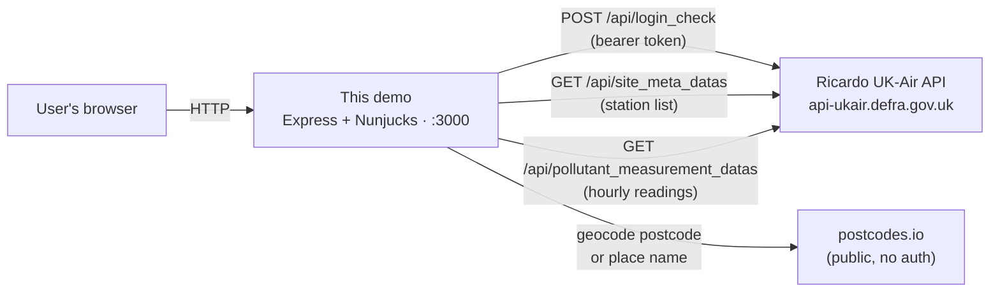

# aqie-demo-data-visualisations

`Node.js` prototype template, using the [GOV.UK Prototype Kit](https://github.com/alphagov/govuk-prototype-kit) and
the [GOV.UK Frontend](https://github.com/alphagov/govuk-frontend).

> Basically the `GOV.UK Prototype Kit` and `GOV.UK Frontend` wrapped up and provided on the Core Delivery Platform

---

## Contents

- [About this prototype](#about-this-prototype)
  - [Architecture & data flow](#architecture--data-flow)
  - [Data sources](#data-sources)
  - [Search](#search)
  - [Cron jobs / scheduled tasks](#cron-jobs--scheduled-tasks)
  - [Dependencies](#dependencies)
  - [What changes are needed to the back end?](#what-changes-are-needed-to-the-back-end)
  - [Key design & implementation choices](#key-design--implementation-choices)
  - [Pollutants, timeframes and data shapes](#pollutants-timeframes-and-data-shapes)
  - [Known limitations (this is a prototype, not production)](#known-limitations-this-is-a-prototype-not-production)
  - [Feasibility assessment](#feasibility-assessment)
  - [Running this prototype locally](#running-this-prototype-locally)
- [Requirements](#requirements)
  - [Node.js](#nodejs)
- [GOV.UK Prototype Kit and GOV.UK Frontend](#govuk-prototype-kit-and-govuk-frontend)
- [Using the refreshed GOV.UK brand](#using-the-refreshed-govuk-brand)
- [Setting a password](#setting-a-password)
- [Setting multiple passwords](#setting-multiple-passwords)
- [Removing the need for a password](#removing-the-need-for-a-password)
- [Npm scripts](#npm-scripts)
- [Updating dependencies](#updating-dependencies)
- [Environment Variables and Secrets](#environment-variables-and-secrets)
  - [Local development](#local-development)
  - [Environment Variables on CDP](#environment-variables-on-cdp)
  - [Environment Variables in the GOV.UK Prototype Kit](#environment-variables-in-the-govuk-prototype-kit)
  - [Secrets](#secrets)
- [Creating a secret](#creating-a-secret)
- [Docker](#docker)
  - [Development image](#development-image)
  - [Production image](#production-image)
  - [Debug docker](#debug-docker)
- [Licence](#licence)
  - [About the licence](#about-the-licence)

---

# About this prototype

This repo is a **non-production spike** exploring interactive hourly air-quality graphs for each
monitoring site, for the DEFRA "Get air pollution data" service. It lets a user find a monitoring
station (by town, postcode or station name), see a **pollutant summary table** (average, data
capture %, hourly exceedances) and **interactive charts** (small multiples or a combined
overlay) across several timeframes.

The summary table and the charts are always derived from the **same series over the same window**, so
changing the timeframe updates both. Hourly exceedances are only meaningful at hourly resolution, so
the longer timeframes — which are served as daily averages — say so rather than showing a count that
cannot be computed.

It was built against two acceptance criteria:

1. A prototype (non-production) graph using **live** monitoring-site data, meeting **government
   accessibility standards**.
2. An **assessment of the feasibility and effort** of delivering hourly site graphs into the Get Data
   service — see [Feasibility assessment](#feasibility-assessment).

> [!IMPORTANT]
> This spike is **entirely self-contained**. It depends on no Defra service: the station list and the
> hourly readings come straight from the Ricardo UK-Air API, and geocoding from postcodes.io. Nothing
> else needs to be running or deployed for it to work. Where this logic would live in production is
> covered in [docs/productionisation-notes.md](docs/productionisation-notes.md).

## Architecture & data flow

All external calls are made **server-side** (Express), so there is no browser cross-origin resource
sharing (CORS) and no API keys in
the client. The summary table and data tables are **rendered on the server** (they work with
JavaScript disabled); the D3 charts are layered on top as progressive enhancement, hydrated from a
JSON block embedded in the page.


```mermaid
flowchart LR
  U["User's browser"] -->|HTTP| D["This demo<br/>Express + Nunjucks · :3000"]
  D -->|"POST /api/login_check<br/>(bearer token)"| R["Ricardo UK-Air API<br/>api-ukair.defra.gov.uk"]
  D -->|"GET /api/site_meta_datas<br/>(station list)"| R
  D -->|"GET /api/pollutant_measurement_datas<br/>(hourly readings)"| R
  D -->|"geocode postcode<br/>or place name"| P["postcodes.io<br/>(public, no auth)"]
```

## Data sources

| Source                                             | Provides                                                                                                                         | Auth          | Called by                                                      | Notes                                                                                                 |
| -------------------------------------------------- | -------------------------------------------------------------------------------------------------------------------------------- | ------------- | -------------------------------------------------------------- | ----------------------------------------------------------------------------------------------------- |
| **Ricardo `GET /api/site_meta_datas`**             | Station list: `siteId` (`UKA00315`), `localSiteId` (`MY1`), name, region, coordinates, per-pollutant metadata                    | Bearer token  | Demo server ([app/lib/ricardo-api.js](app/lib/ricardo-api.js)) | Called with `with-pollutants=true`. Only `stationStatus: current` sites are kept, cached for 6 hours. |
| **Ricardo `GET /api/pollutant_measurement_datas`** | Hourly readings per pollutant over a date range                                                                                  | Bearer token  | Demo server ([app/lib/ricardo-api.js](app/lib/ricardo-api.js)) | One call per pollutant, issued in parallel. See the parameter traps below.                            |
| **postcodes.io**                                   | Latitude/longitude for a postcode or outcode (`/postcodes`, `/outcodes`) and for a town or place name (`/places`, OS Open Names) | None (public) | Demo server ([app/lib/search.js](app/lib/search.js))           | Nearest 5 stations ranked by haversine distance. See [Search](#search) for the resolution order.      |

> [!IMPORTANT]
> **Three traps in the Ricardo API, all of which fail silently.**
>
> 1. **Date parameters are `start-date` / `end-date`** (`YYYY-MM-DD`). The `start-date-time` /
>    `end-date-time` forms used elsewhere in the estate are not in the API's OpenAPI spec, and
>    **unknown query parameters are ignored without error** — the request then falls back to
>    `latest-measurement` and returns roughly 33 hours while appearing to succeed.
> 2. **Results are capped at 10,000 rows**, and `page=2` is always empty, so the cap cannot be
>    paginated past. Exceeding it truncates the series with no error. Both windows this prototype
>    serves are far below the cap; a year of SO₂ would not be.
> 3. **`-9999` means "no reading"**, not a value. Averaging it drags every figure far negative.
>    [app/lib/ricardo-api.js](app/lib/ricardo-api.js) maps negatives to `null` so they become gaps.
>
> The spec is public and authoritative:
> `curl -H 'Accept: application/vnd.openapi+json' https://uk-air-api.staging.rcdo.co.uk/api/docs.jsonopenapi`

## Search

A user can search by **town or place name**, **postcode or outcode**, or **monitoring station name**.
[app/lib/search.js](app/lib/search.js) resolves a query in this order, stopping at the first hit:

| #   | Query looks like            | Lookup                                    | Result                                           |
| --- | --------------------------- | ----------------------------------------- | ------------------------------------------------ |
| 1   | Postcode or outcode         | postcodes.io `/postcodes` or `/outcodes`  | 5 nearest stations, with distance in km          |
| 2   | Part of a station name      | Local substring match on the station list | Up to 10 matching stations, no distance shown    |
| 3   | Anything else (town, place) | postcodes.io `/places` (OS Open Names)    | 5 nearest stations, with distance in km          |
| 4   | No match                    | —                                         | Empty results, with a prompt to try another term |

Station names are matched **before** the place lookup on purpose: "Manchester" and "Marylebone Road"
both exist in OS Open Names, so geocoding first would hide the station the user most likely meant.

Distances are great-circle (haversine) from the geocoded point to each station's `latitude` and
`longitude`, which the station endpoint returns as separate numeric fields.

## Cron jobs / scheduled tasks

- **This demo has _no_ cron jobs and no database.** It fetches live data on every request.
- The station list is cached in-process for **6 hours** and the bearer token for **50 minutes**;
  readings are not cached. Both caches are per-instance, so with multiple replicas each warms
  independently.

## Dependencies

Runtime (see [package.json](package.json)):

- **`govuk-prototype-kit` 13.18.0** + **`govuk-frontend` 5.11.1** — Express/Nunjucks server and GDS components.
- **`d3` 7.9.0** — Scalable Vector Graphics (SVG) charts. Prototype Kit 13 does not bundle `application.js`, so D3 is **vendored**
  at [app/assets/javascripts/vendor/d3.min.js](app/assets/javascripts/vendor/d3.min.js) and loaded via a
  `<script>` tag on the station page only.
- **Node.js ≥ 22** — uses the global `fetch`, `AbortController` and `Intl` timezone formatting; no polyfills.

There is **no database, message queue, or build step** in this repo.

## What changes are needed to the back end?

**None.** This prototype talks to the Ricardo UK-Air API directly and depends on no Defra service.
The station list, the hourly readings and the geocoding are all fetched server-side from public or
token-authenticated APIs.

## Key design & implementation choices

| Choice                                                      | Why                                                                                                                      |
| ----------------------------------------------------------- | ------------------------------------------------------------------------------------------------------------------------ |
| **Series and stations direct from the Ricardo API**         | The prototype is self-contained: no Defra service has to be running or changed for it to work                            |
| **Stations keyed by Ricardo `siteId` (`UKA00315` form)**    | The only identifier `pollutant_measurement_datas` accepts; `localSiteId` (`MY1`) returns a 422                           |
| **Window anchored on the latest reading, not the clock**    | A station that stopped publishing shows a gap rather than a window of empty hours                                        |
| **Closed stations filtered out**                            | The upstream list includes sites closed years ago; a "last 24 hours" view of one is always empty                         |
| **D3 v7 (SVG) charts**                                      | Accessibility (focusable, labelable) and MIT licence vs canvas/commercial libs                                           |
| **Combined default + small multiples variant**              | Combined is compact for spotting episodes at a glance; small multiples avoid conflating pollutants with different scales |
| **Server-side rendering + progressive enhancement**         | Core info (tables) works with no JavaScript; charts enhance on top                                                       |
| **Explicit legal limits (NO₂ 200, SO₂ 350 µg/m³ only)**     | "Hourly exceedances" only applies where an hourly legal limit exists; DAQI bands are a health index, not a legal limit   |
| **Non-colour-only encoding** (colour + line style + legend) | Web Content Accessibility Guidelines (WCAG) — do not rely on colour alone                                                |
| **Query-param-driven variants** (`?period=`, `?layout=`)    | Every variant is a shareable, bookmarkable link — useful for user research                                               |

## Pollutants, timeframes and data shapes

**Pollutant codes.** Ricardo needs a different code on the way in from the one it sends back, and two
of the five are rejected under their display names. [app/lib/ricardo-api.js](app/lib/ricardo-api.js)
maps both directions onto the canonical codes in [app/data/pollutants.js](app/data/pollutants.js):

| Canonical | Requested as | Returned as                                             | Displayed as     |
| --------- | ------------ | ------------------------------------------------------- | ---------------- |
| `PM25`    | `PM25`       | `PM<sub>2.5</sub> particulate matter (Hourly measured)` | PM2.5            |
| `PM10`    | **`GE10`**   | `PM<sub>10</sub> particulate matter (Hourly measured)`  | PM10             |
| `NO2`     | `NO2`        | `Nitrogen dioxide`                                      | Nitrogen dioxide |
| `O3`      | `O3`         | `Ozone`                                                 | Ozone            |
| `SO2`     | `SO2`        | `Sulphur dioxide`                                       | Sulphur dioxide  |

`PM10` and `PM2.5` are **rejected as invalid** if sent under those names — they must be asked for as
`GE10` and `PM25`. Returned names arrive with HTML subscript markup, which is stripped before use.

**Timeframes.** `?period=` maps to a date range on the readings endpoint:

| `period` | Sent as                         | Points per pollutant | Resolution |
| -------- | ------------------------------- | -------------------- | ---------- |
| `24h`    | `start-date`/`end-date`, 1 day  | 24                   | hourly     |
| `7d`     | `start-date`/`end-date`, 7 days | 168                  | hourly     |

The API takes whole dates, so a request returns a little more than asked for; the series is trimmed
back to an exact window ending at the most recent reading. Some pollutants (SO₂) also return
15-minute rows alongside the hourly ones and `data-type` does **not** separate them, so rows are
filtered on their own interval instead.

**Internal history shape** returned by `getHistory()`:

```
{ siteId, period, resolution: 'hourly', from, to,
  pollutants: { <CODE>: [ { time, value } ] } }
```

`value` is `null` where the instrument produced no reading (upstream `-9999`), and that is what the
data-capture percentage measures. `from`/`to` bound the trimmed window, and both the page label and
the summary table are derived from them.

## Known limitations (this is a prototype, not production)

- **Only two timeframes.** The prototype serves the last 24 hours and the last 7 days, which are the
  two the design lead identified as critical. Longer ranges are available from the API but are out of
  scope for this spike — see [docs/productionisation-notes.md](docs/productionisation-notes.md).
- **AURN stations only** (213 current sites). Non-AURN metadata exists upstream but its coverage is
  unverified, so areas covered only by local networks will show a distant station instead.
- **Combined chart uses a shared y-axis**, so low-value pollutants (e.g. SO₂) appear flat next to O₃.
- **Search results are not distance-capped** — a town far from any monitor still returns its 5
  nearest stations, which may be tens of kilometres away.
- **Ambiguous place names take the first match** (`/places` is queried with `limit=1`), so there is no
  disambiguation step for, say, the several Newports.
- **Service-navigation tabs** from the mockups are omitted to avoid dead links.

## Feasibility assessment

The second acceptance criterion. Short answer: **feasible, with low–moderate back-end effort.**

- **Back-end (none needed).** The prototype calls the Ricardo UK-Air API directly, so no Defra
  service has to be built or changed to run it. A production implementation would more likely put
  this behind a service of its own, so credentials live in one place, but nothing here depends on
  that happening first.
- **Front end (moderate).** Location search, D3 charts, accessible equivalents and the layout variants
  were the bulk of the work in this spike; it was all achievable within the Prototype Kit and reached
  **0 axe-core WCAG 2.2 A/AA violations** across all pages, verified with keyboard-only navigation,
  contrast checks and JavaScript disabled.
- **Main risks.** Credential management for the Ricardo API, the silent 10,000-row cap on longer
  ranges, and AURN-only station coverage.

## Running this prototype locally

1. Copy [.env.template](.env.template) to `.env` and fill in `RICARDO_API_EMAIL` and
   `RICARDO_API_PASSWORD`. No other service needs to be running.
2. `npm install`, then `npm run dev` and open `http://localhost:3000`. The home page reports whether
   the API and the postcode lookup are reachable.
3. `RICARDO_TIMEOUT_MS` (default `20000`) bounds each call.

> [!WARNING]
> **Quote the password in `.env` if it contains `#`.** `dotenv` treats an unquoted `#` as the start of
> a comment and truncates the value there, so `RICARDO_API_PASSWORD=secret#` arrives as `secret` and
> every call fails with `401 Invalid credentials` — which looks exactly like an expired password.
> `RICARDO_API_PASSWORD="secret#"` is parsed correctly.

### Running on CDP

The localhost default is only useful locally. When deployed, two things must be in place or every
outbound call fails with `fetch failed`:

- **`RICARDO_API_EMAIL` and `RICARDO_API_PASSWORD` must be set** for the environment. These are
  credentials, so they belong on the CDP **Secrets** page rather than in `cdp-app-config`. The three
  `RICARDO_API_*_URL` values are not sensitive and can go in `cdp-app-config`; they default to
  production if unset.
- **`.cdp-int.defra.cloud` hosts are internal.** They cannot be curled from a laptop without the
  Defra VPN — an SSL/connection error from your own machine says nothing about the deployed app.
  Check from inside the container instead. **The CDP Portal terminal is not available for this
  service**, so the home page reports the data-source URL, whether a proxy is configured, and the
  status of each data source.
- **Outbound internet goes through the CDP squid proxy.** Node's global `fetch` ignores the standard
  `*_PROXY` environment variables, so [app/lib/proxy.js](app/lib/proxy.js) installs an `undici`
  `EnvHttpProxyAgent` as the global dispatcher when a proxy variable is present. Only the platform's
  own hosts (`NO_PROXY`, `localhost`, `.cdp-int.defra.cloud`) bypass it. **Every data call this
  prototype makes now leaves the platform**, so squid can block all of them — which is why the tunnel
  probes below matter more than they used to.
- **Which proxy variable is used matters.** `HTTPS_PROXY`/`HTTP_PROXY` are `http://localhost:3128`,
  the squid sidecar every CDP container runs, and **that sidecar is what enforces this service's
  `cdp-tenant-config` allow-list**. `CDP_HTTPS_PROXY` is the legacy central proxy
  (`https://proxy.<env>.cdp-int.defra.cloud`); CDP still injects it and still supports it, but it
  does not honour the same allow-list. Preferring it black-holes allowed hosts _silently_ — the
  `CONNECT` never gets a reply, so it reads as a slow origin rather than a block, while unrelated
  hosts keep working. `proxy.js` therefore prefers `HTTPS_PROXY` → `HTTP_PROXY` →
  `CDP_HTTPS_PROXY` → `CDP_HTTP_PROXY`, matching the CDP guidance that `HTTPS_PROXY` "should be
  preferred when updating existing" services. The agent also sets `proxyTls: { allowH2: false }` for
  the legacy fallback, which is an `https://` URL: `undici` 8 offers `h2` in ALPN by default, so the
  connection to squid itself negotiates HTTP/2 — a `CONNECT` tunnel cannot be opened over an h2
  session, and every egress call fails with `fetch failed (ERR_HTTP2_ERROR)`. Note that a top-level
  `allowH2` does _not_ cover this: `ProxyAgent` builds the proxy-side connector from `proxyTls` alone.
- **Both data hosts must be allowed through squid.** `api.postcodes.io` **and**
  `api-ukair.defra.gov.uk` need to be on the environment's egress allow-list in `cdp-tenant-config`.
  If the postcode host were removed, location search would return no stations; if the Ricardo host
  were removed, nothing would load at all. **A block is not always fast**: squid may deny the
  `CONNECT` (quick failure) or silently drop it, which is indistinguishable from a slow origin until
  you look at the tunnel. A `CONNECT` is therefore probed directly for every `*_PROXY` variable in
  the environment, shown under `Connection details` on the home page. `CONNECT 200` means the tunnel
  is fine; a `403`/`3xx` block page or `no response within 8000ms` means the host needs
  allow-listing.

> [!NOTE]
> Two failures during this spike were both **silent successes** rather than errors, and cost far more
> time than a hard failure would have: a password truncated at a `#` by `dotenv`, which reads as an
> expired credential; and date parameters under the wrong names, which the API ignores while still
> returning `200` and plausible-looking data. The lesson that survives in the code is to check the
> _shape_ of what came back — the row count, the span, the sign of the values — rather than trusting
> a status code.

---

## Requirements

### Node.js

Install [Node.js](http://nodejs.org/) `>= v22` and [npm](https://nodejs.org/) `>= v11`. You will find it easier to use
the Node Version Manager [nvm](https://github.com/creationix/nvm)

To use the correct version of Node.js for this application, via nvm:

```bash
cd aqie-demo-data-visualisations
nvm use
```

## GOV.UK Prototype Kit and GOV.UK Frontend

The [GOV.UK Prototype Kit](https://github.com/alphagov/govuk-prototype-kit) is a tool for building interactive
prototypes that look like pages on GOV.UK, it provides components and styles from the
[GOV.UK Frontend](https://github.com/alphagov/govuk-frontend). Both are provided by the
[Government Digital Service (GDS)](https://www.gov.uk/government/organisations/government-digital-service), this
template provides both tools in a wrapper that runs on the Core Delivery Platform at Defra.

> [!NOTE]
> The `GOV.UK Prototype Kit` is built with [express.js](https://expressjs.com/). The `Node.js`
> applications [cdp-node-frontend-template](https://github.com/DEFRA/cdp-node-frontend-template)
> and [cdp-node-backend-template](https://github.com/DEFRA/cdp-node-backend-template) at Defra are built with
> [Hapi.js](https://hapi.dev/)

- For information on the `GOV.UK Prototype Kit` see https://prototype-kit.service.gov.uk/docs/
- For tutorials on how to use the `GOV.UK Prototype Kit`
  see https://prototype-kit.service.gov.uk/docs/tutorials-and-guides
- For help with the underlying `GOV.UK Frontend` see:
  - https://design-system.service.gov.uk/
  - https://github.com/alphagov/govuk-frontend

> [!WARNING]
> The `aqie-demo-data-visualisations` is not a production ready application, it is a tool for prototyping. It is not
> designed to be used in production or to be resilient, secure or performant, nor should it be. It is designed to be
> used for prototyping ideas and testing them with users. It's a great tool for prototyping GOV web applications.

## Using the refreshed GOV.UK brand

The refreshed GOV.UK brand is available and turned on by default in the `aqie-demo-data-visualisations`. To turn it
off simply go to [app/config.json](./app/config.json) and set the `"rebrand"` property to `false`. This will turn off
the refreshed brand and use the legacy brand instead.

```json
{
  "plugins": {
    "govuk-frontend": {
      "rebrand": true
    }
  }
}
```

## Setting a password

> [!CAUTION]
> Do not commit the `.env` file to GitHub, it is in the `.gitignore` file by default. Sensitive information such as a
> password can be provided to a prototype via the Secrets page of your prototype in the CDP Portal Frontend

Basic authentication is on by default in CDP environments for prototypes. This means you will need to set a password
for your prototype. You can do this via your prototypes secrets tab in the Portal Frontend. For information on how to do
this, follow these steps:

1. Read the **Setting a password** section on https://prototype-kit.service.gov.uk/docs/publishing
1. Go to the CDP Portal Frontend
1. Log in
1. Navigate to your prototype on the services list page
1. Navigate to your prototypes `Secrets` tab
1. Add a secret with a name `PASSWORD` and a `value` of your choosing
1. Re-deploy your prototype for the new secrets to be made available to it

## Setting multiple passwords

The `GOV.UK Prototype Kit` has the ability to set up multiple passwords via secrets. For more information on how to do
this read the **If you want to create additional passwords** section on
https://prototype-kit.service.gov.uk/docs/publishing. To add a secret to an environment your prototype is running in
see [Creating a secret](#creating-a-secret)

## Removing the need for a password

By default, the `GOV.UK Prototype Kit` requires a password has been set on your prototype when it has been deployed to
an environment. If you would like to turn off this requirement you can do so by setting the following environment
variable:

```dotenv
ENV USE_AUTH=false
```

This can be set in `cdp-app-config` for instructions on how to do so
read [Environment Variables on CDP](#environment-variables-on-cdp).

## Npm scripts

All available Npm scripts can be seen in [package.json](./package.json)
To view them in your command line run:

```bash
npm run
```

## Updating dependencies

To update dependencies use [npm-check-updates](https://github.com/raineorshine/npm-check-updates):

> The following script is a good start. Check out all the options on
> the [npm-check-updates](https://github.com/raineorshine/npm-check-updates)

```bash
ncu --interactive --format group
```

## Environment Variables and Secrets

Environment variables and Secrets are used to configure your prototype. Where you set them can be seen in the table
below.

| Type                                                      | Environment | Where to set them                                   |
| --------------------------------------------------------- | ----------- | --------------------------------------------------- |
| Sensitive secrets and Non-sensitive environment variables | local       | `.env` file                                         |
| Sensitive secrets                                         | CDP         | CDP Portal Frontend services secrets page           |
| Non-sensitive environment variables                       | CDP         | CDP App Config repository by raising a pull request |

### Local development

> [!CAUTION]
> Do not store passwords in GitHub. Sensitive information such as a password can be provided to a prototype via the
> secrets page in the CDP Portal Frontend. The `.env` file is for local development only.

To set environment variables and secrets locally copy the [.env.template](./.env.template) file to `.env` and add any
environment variables or secrets your local environment needs.

### Environment Variables on CDP

When your prototype is running on a CDP environment, E.g. `dev` or `ext-test`. You can set environment variables via a
GitHub pull request.

To add environment variables read - https://github.com/DEFRA/cdp-documentation/blob/main/how-to/config.md. This will
guide you to add non-sensitive environment variables to the https://github.com/DEFRA/cdp-app-config repository via a
pull request.

### Environment Variables in the GOV.UK Prototype Kit

The following environment variables are available in the `GOV.UK Prototype Kit`. For more information see
their https://prototype-kit.service.gov.uk/docs/ or https://github.com/alphagov/govuk-prototype-kit.

| Name            | Value    | Description                                              |
| --------------- | -------- | -------------------------------------------------------- |
| `PASSWORD`      | `string` | Password for basic authentication                        |
| `PASSWORD_KEYS` | `string` | Comma-separated list of keys for password authentication |

### Secrets

To add sensitive environment variables know as secrets to your prototype. Add them via your prototypes secrets page on
the CDP Portal.

## Creating a secret

1. Go to the CDP Portal Frontend
1. Log in
1. Navigate to your prototype on the services list page
1. Navigate to your prototypes `Secrets` tab
1. Add a secret on your chosen environment with a `name` and `value` of your choosing
1. Re-deploy your prototype for the new secrets to be made available to it

## Docker

For the most part you will not need to be concerned with `docker` when running this prototype. Everything is set up and
your `docker` will automatically be built, published and pushed when you deploy a new version of your prototype via the
UI in the CDP Portal.

### Development image

Build:

```bash
docker build --target development --no-cache --tag aqie-demo-data-visualisations:development .
```

Run:

```bash
docker run -e PORT=3000 -p 3000:3000 aqie-demo-data-visualisations:development
```

### Production image

Build:

```bash
docker build --no-cache --tag aqie-demo-data-visualisations .
```

Run:

> Update the password field to your password

```bash
docker run -e PASSWORD=beepBoopBeep -e PORT=3000 -p 3000:3000 aqie-demo-data-visualisations
```

### Debug docker

To debug issues in docker and to have a look at the built docker container in the same way as when it runs on CDP. You
can run an interactive shell:

Build:

```bash
docker build --no-cache --tag aqie-demo-data-visualisations .
```

Run:

```bash
docker run -it --entrypoint /bin/ash aqie-demo-data-visualisations
```

## Licence

THIS INFORMATION IS LICENSED UNDER THE CONDITIONS OF THE OPEN GOVERNMENT LICENCE found at:

<http://www.nationalarchives.gov.uk/doc/open-government-licence/version/3>

The following attribution statement MUST be cited in your products and applications when using this information.

> Contains public sector information licensed under the Open Government license v3

### About the licence

The Open Government Licence (OGL) was developed by the Controller of Her Majesty's Stationery Office (HMSO) to enable
information providers in the public sector to license the use and re-use of their information under a common open
licence.

It is designed to encourage use and re-use of information freely and flexibly, with only a few conditions.
